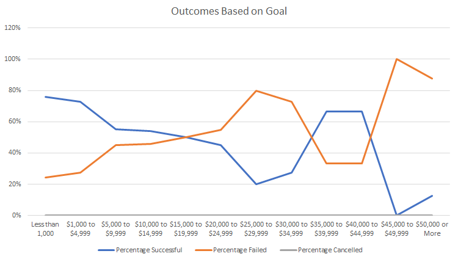

# Kickstarting with Excel

## Overview of Project

### Purpose
Assessment about how different play campaigns fared in relation to their launch dates and their funding goals.

## Analysis and Challenges

### Analysis of Outcomes Based on Launch Date
Used pivot tables and graphing in Excel to visualize campaign outcomes ("successful," "failed," and "canceled") based on launch date from the "Kickstarter" dataset.
Created a line chart from the pivot table to visualize the relationship between outcomes and launch month.

### Analysis of Outcomes Based on Goals
Visualized the percentage of successful, failed, and canceled plays based on the funding goal amount. 
Used COUNTIFS() functions to populate "Number Successful," "Number Failed," and "Number Canceled" columns.
Created a line chart to visualize the relationship between the goal-amount ranges on the x-axis and the percentage of successful, failed, or canceled projects on the y-axis. 

### Challenges and Difficulties Encountered
Encountered and resolved the following challenges:
1. Forgot to "unfreeze" panes in master "Kickstarter" data sheet from a previous analysis, which affected filtering capabilities.  Filtering capability was restored by unfreezing panes.
2. Misspelled "canceled" in COUNTIFS function, resulting in nonsensical results.  Checked and corrected spelling to achieve sensical results.

## Results

- What are two conclusions you can draw about the Outcomes based on Launch Date?
1. The month with the highest number of successful theater campaign launches is May.
2. The month with the lowest number of successful theater campaign launches is December.

- What can you conclude about the Outcomes based on Goals?
1. The target range for a theater/play campaign goal should be either 1] less than $15,000 or 2] between $35,000-$45,000.  Campaign goals larger than $45,000 should be avoided.

- What are some limitations of this dataset?
1. The dataset only contains information for campaigns launched between 2009 and 2017. It also contains data for a limited number of countries and media categories.

- What are some other possible tables and/or graphs that we could create?
1. It would be interesting to assess a campaign outcome based on its duration.  Although not in the dataset, as assessment of a play's audience rating compared to fundraising performance could be insightful.

